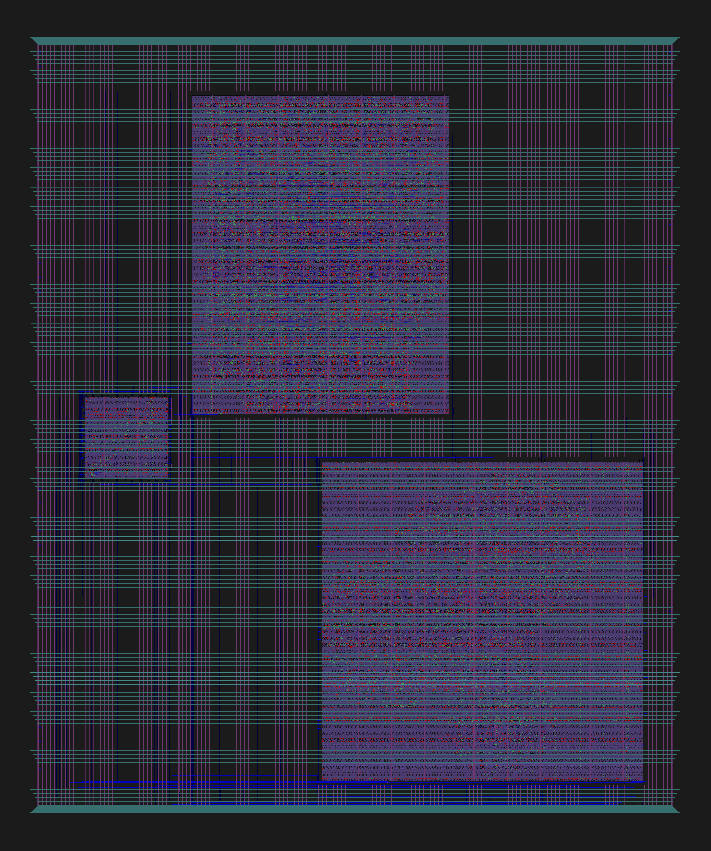
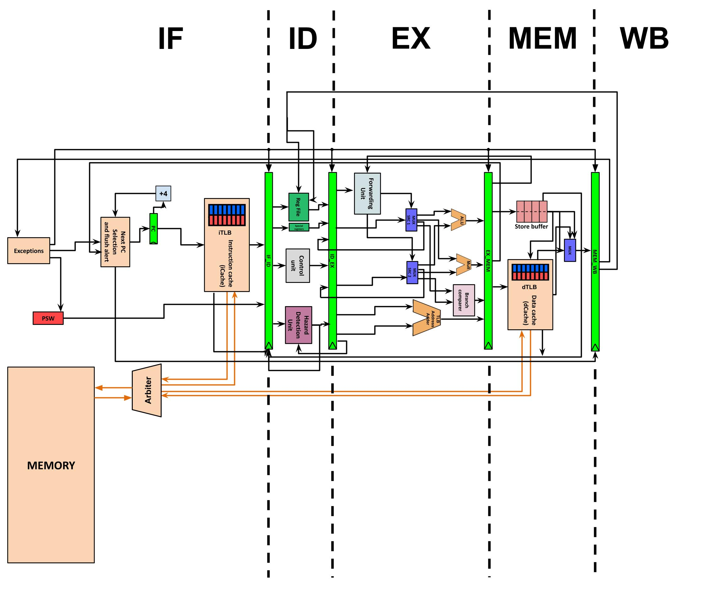

# Elpis Light processor

[](https://opensource.org/licenses/BSD-3-Clause) [](https://github.com/theatomb/Elpis-Light-MPW3/actions/workflows/user_project_ci.yml) [](https://github.com/theatomb/Elpis-Light-MPW3/actions/workflows/caravel_build.yml)

## **Authors**
- Rodrigo Huerta ([@rodhuega]( https://github.com/rodhuega )) (UPC¹) 
- Aurora Tomás ([@theatomb]( https://github.com/theatomb )) (UPC¹)
<br/>
¹ Universitat Politècnica de Catalunya (UPC)  <br/>

## **Chip layout**


## **Chip description**

Elpis is a 5-stage pipelined and multi-cycle processor implemented from scratch based on RISC-V architecture, mixed with some MIPS ideas. However, due to the limitations of the tools this Elpis is lighter than our initial Elpis core. Anyway, the version that we present has the following characteristics:

- 32 integer registers 
- Special register file
- Full bypasses
- Powerful instruction set, mainly based on RISC-V instructions, but with some customed ones
- L1 instruction and data caches (iCache and dCache)
- Main memory simulates 5 cycles delay per access, to be more realistic
- Store buffer
- Support to exceptions
- I/O support
- Simulated virtual memory support (NO TLBs!)

### **Pipeline diagram**


### **ISA**
The supported instructions by Elpis are: ADD, SUB, MUL, LDB, LDW, STB, STW, BEQ, JUMP, IRET, MOVE, TLBWRITE, ADDI, OR, ORI, AND, ANDI, XOR, XORI, SLL, SRL, SRA, SLLI, SRLI, SRAI, BGE, BLT, BNE, MOVR, ECALL, READ, PRINT. 
The instruction set encoding is mainly based on RISCV32, but there are some differences respecting the pipeline management where we present new instructions not existing in RISC-V:

- **IRET**: It is always codified as ``0x0000007F``, sets the PSW to 0 (user mode) and jumps to the PC that RM0 holds. This instruction is only permitted to execute if PSW=1 (privileged mode).
- **JUMP**: Jumps to the address that the given register points to. For example, the instruction semantics could be ``jump x9``, where its decoding will result in an OPCODE [6:0] = 1101111 and destination register = [19:15]. As for the rest, the other bits are ignored.
- **MOV**: Used to move register data from special registers to regular ones. For example, the instruction semantics could be ``mov x7, rm2``, where its decoding will result in an OPCODE [6:0] = 0101111, funct7 [31:25]= 0000000, source register (special register) = [21:20] and destination register (regular register) = [11:7]. As for the rest, the other bits are ignored. 
- **MOVR**: Used to move register data from regular registers to special ones. For example, the instruction semantics could be ``movr rm4 x15``, where its decoding will result in an OPCODE [6:0] = 0101111, funct7 [31:25] = 0000001, source register (regular register) = [21:20] and destination register (special register) = [11:7]. As for the rest, the other bits are ignored.
- **ECALL**: It is an instruction to call the operating system, so user-mode has to be enabled. However, at the moment, there are only supported two different calls. If it is performed ``ecall 6`` is codified as ``0x00600073``, otherwise if is an ``ecall 7`` is codified as ``0x00700073``. The code 6 is used in case we want to send data to PicoRV, and the code 7 is used in case we want to receive data from PicoRV. 
- **PRINT**: This instruction sends into the PicoRV whatever is inside the special register rm4, and it is always codified as ``0x0200007D``. However, this instruction is only legal if privileged mode is enabled. On the other hand, if user mode is enabled it should be executed through an ecall instruction (``ecall 6``), which would result in an equivalent functionality.
- **READ**: This instruction receives a value from PicoRV, and it is always codified as ``0x0400007D``. However, this instruction is only legal if privileged mode is enabled. On the other hand, if user mode is enabled it should be executed through an ecall instruction (``ecall 7``), which would result in an equivalent functionality.

## **How to use the chip**

First of all, we need the following function in order to load the instructions and data into Elpis:

```C++
void elpis_load_memory(uint32_t*  program_data, uint32_t*  program_addr)
{
	int i, continue_reading;
	continue_reading = 1;
	i = 0;
	reg_la3_data = 0x00000004;
	reg_la3_data = 0x00000005;
	reg_la3_data = 0x00000004;
	while (continue_reading)
	{
		if (program_data[i] == ((uint32_t) 0xFFFFFFFF))
		{
			continue_reading = 0;
		}else {
			reg_la0_data = program_addr[i];
			reg_la1_data = program_data[i];
		}
		reg_la3_data = 0x00000005;
		reg_la3_data = 0x00000004;
		i++;
	}
	reg_la3_data = 0x00000001;
	reg_la3_data = 0x00000000;
}
``` 
Inside the ``main()`` function we perform the following steps:

```C++
void main(){
  ...
    // Configuring LA probes
	// outputs from the cpu are inputs for my project denoted for been 0
	// inputs to the cpu are outpus for my project denoted for been 1
	reg_la0_oenb = reg_la0_iena = 0x00000000; // [31:0]
	reg_la1_oenb = reg_la1_iena = 0x00000000; // [63:32]
	reg_la2_oenb = reg_la2_iena = 0x00000000; // [95:64]
	reg_la3_oenb = reg_la3_iena = 0x00000000; // [127:96]
  
    // Flag start of the test
	reg_mprj_datal = 0xAB400000;

	// Elpis OS information
	uint32_t OS_DATA[30];
	OS_DATA[0] = 0x00502023;
	OS_DATA[1] = 0x00602223;
	OS_DATA[2] = 0x00702423;
	OS_DATA[3] = 0x00802623;
	OS_DATA[4] = 0x00902823;
	OS_DATA[5] = 0x00400413;
	OS_DATA[6] = 0x00500493;
	OS_DATA[7] = 0x00600293;
	OS_DATA[8] = 0x00700313;
	OS_DATA[9] = 0x002003af;
	OS_DATA[10] = 0x00838c63;
	OS_DATA[11] = 0x00938a63;
	OS_DATA[12] = 0x00538c63;
	OS_DATA[13] = 0x00638e63;
	OS_DATA[14] = 0x00038e63;
	OS_DATA[15] = 0x02000863;
	OS_DATA[16] = 0x0000002e;
	OS_DATA[17] = 0x00000863;
	OS_DATA[18] = 0x0200007D;
	OS_DATA[19] = 0x00000463;
	OS_DATA[20] = 0x0400007D;
	OS_DATA[21] = 0x00002283;
	OS_DATA[22] = 0x00402303;
	OS_DATA[23] = 0x00802383;
	OS_DATA[24] = 0x00c02403;
	OS_DATA[25] = 0x01002483;
	OS_DATA[26] = 0x0000007F;
	OS_DATA[27] = 0x00000033;
	OS_DATA[28] = 0x00002050;
	OS_DATA[29] = 0xFFFFFFFF;

	uint32_t OS_ADDR[30];
	OS_ADDR[0] =  0x00000010;
	OS_ADDR[1] =  0x00000011;
	OS_ADDR[2] =  0x00000012;
	OS_ADDR[3] =  0x00000013;
	OS_ADDR[4] =  0x00000014;
	OS_ADDR[5] =  0x00000015;
	OS_ADDR[6] =  0x00000016;
	OS_ADDR[7] =  0x00000017;
	OS_ADDR[8] =  0x00000018;
	OS_ADDR[9] =  0x00000019;
	OS_ADDR[10] = 0x0000001a;
	OS_ADDR[11] = 0x0000001b;
	OS_ADDR[12] = 0x0000001c;
	OS_ADDR[13] = 0x0000001d;
	OS_ADDR[14] = 0x0000001e;
	OS_ADDR[15] = 0x0000001f;
	OS_ADDR[16] = 0x00000020;
	OS_ADDR[17] = 0x00000021;
	OS_ADDR[18] = 0x00000022;
	OS_ADDR[19] = 0x00000023;
	OS_ADDR[20] = 0x00000024;
	OS_ADDR[21] = 0x00000025;
	OS_ADDR[22] = 0x00000026;
	OS_ADDR[23] = 0x00000027;
	OS_ADDR[24] = 0x00000028;
	OS_ADDR[25] = 0x00000029;
	OS_ADDR[26] = 0x0000002a;
	OS_ADDR[27] = 0x0000002b;
	OS_ADDR[28] = 0x00000005;
	OS_ADDR[29] = 0xFFFFFFFF;

	// Elpis user program
    // Sending data to Elpis example
	uint32_t USER_DATA[4];
	USER_DATA[0] = 0x00200093;
	USER_DATA[1] = 0x0210022F;
	USER_DATA[2] = 0x00600073;
	USER_DATA[3] = 0xFFFFFFFF;

	uint32_t USER_ADDR[4];
	USER_ADDR[0] = 0x00000040;
	USER_ADDR[1] = 0x00000041;
	USER_ADDR[2] = 0x00000042;
	USER_ADDR[3] = 0xFFFFFFFF;

	// Loading Elpis memory
	elpis_load_memory(OS_DATA, OS_ADDR);
	elpis_load_memory(USER_DATA, USER_ADDR);
	
	reg_la3_oenb = reg_la3_iena = 0x00000001; // Recovering fast clock not controlled by the user

	// Reset of Elpis and start of computation at Elpis
	reg_la3_data = 0x00000002;
	reg_la3_data = 0x00000000;

    // Start of sending data to PicoRV section (if needed)
	// Check bit 100 to be active
	while (reg_la3_data != 0x00000010);

	// Check bit 100 has the right data
	if (reg_wb_reads == 0x00000002){
        print("OK\n\n");
    }
    else {
        print("ERROR\n\n");
    }
    // End of sending data to PicoRV section (if needed)
  
    // Start of receiving data from PicoRV section (if needed)
	reg_la2_data = 0x00000002; // Setting the value that will be read at Elpis
	reg_la3_data = 0x00000008; // Notice Elpis that the values has been sent
	reg_la3_data = 0x00000000; // Stop notifiying Elpis that the value has been sent
    // End of receiving data from PicoRV section (if needed)
  
}
``` 

## **Available tests**
We provide a set of tests that verifies all the described functionality. 

### **RTL**
The tests that we are providing in RTL are the following:

- [testBasicOps](https://github.com/theatomb/Elpis-Light-MPW3/tree/main/verilog/dv/testBasicOps): This test checks the basic behaviour of the CPU.

- [testRead](https://github.com/theatomb/Elpis-Light-MPW3/tree/main/verilog/dv/testRead): This test checks that PicoRV is able to send data to Elpis.

- [testPrint](https://github.com/theatomb/Elpis-Light-MPW3/tree/main/verilog/dv/testPrint): This test checks that Elpis is able to send data to PicoRV.

- [testBytes](https://github.com/theatomb/Elpis-Light-MPW3/tree/main/verilog/dv/testBytes): This test checks that Elpis performs correctly loads and stores and in byte-level.

- [testMul3](https://github.com/theatomb/Elpis-Light-MPW3/tree/main/verilog/dv/testMul3): This test checks that Elpis is able to do multiplications properly.

### **GL**
The tests that we are providing in GL are the following:

- [testPrint](https://github.com/theatomb/Elpis-Light-MPW3/tree/main/verilog/dv/testPrint): This test checks that Elpis is able to send data to PicoRV.